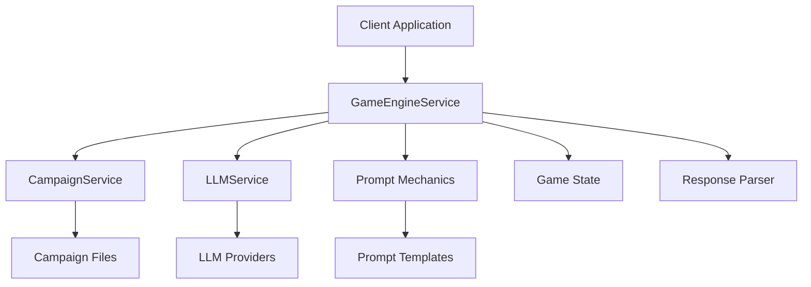

# Engine Architecture

The NovAI game engine is built with a modular, extensible architecture that separates concerns and enables easy customization.

## System Architecture



## Core Services

### GameEngineService

The main orchestrator that coordinates all game operations.

```typescript
export class GameEngineService {
  private llmService: LLMService;
  private campaignService: CampaignService;

  constructor(llmConfig: LLMConfig, campaignsPath?: string) {
    this.llmService = new LLMService(llmConfig);
    this.campaignService = new CampaignService(campaignsPath);
  }

  async processGameRequest(request: GameRequest): Promise<GameResponse> {
    // 1. Load campaign data
    const campaign = await this.campaignService.loadCampaign(
      request.gameState.campaignId
    );

    // 2. Build prompts
    const systemPrompt = await this.buildSystemPrompt(
      campaign,
      request.gameState
    );
    const userPrompt = this.buildUserPrompt(
      request.playerInput,
      request.gameState,
      request.context
    );

    // 3. Call LLM
    const aiResponse = await this.llmService.callLLM(
      `${systemPrompt}\n\n${userPrompt}`,
      this.getNarrativeMemory(request.gameState),
      0.7
    );

    // 4. Parse and update state
    const updatedGameState = this.updateGameState(
      request.gameState,
      request.playerInput,
      aiResponse
    );
    const parsedResponse = this.parseAIResponse(aiResponse);

    return {
      ...parsedResponse,
      updatedGameState,
    };
  }
}
```

### LLMService

Handles communication with various LLM providers.

```typescript
export class LLMService {
  constructor(private config: LLMConfig) {}

  async callLLM(
    prompt: string,
    memory: string[],
    temperature: number = 0.7
  ): Promise<string> {
    switch (this.config.provider) {
      case "openai":
        return this.callOpenAI(prompt, memory, temperature);
      case "local":
        return this.callLocalLLM(prompt, memory, temperature);
      default:
        throw new Error(`Unsupported LLM provider: ${this.config.provider}`);
    }
  }
}
```

### CampaignService

Manages campaign data and metadata.

```typescript
export class CampaignService {
  constructor(private campaignsPath?: string) {}

  async loadCampaign(campaignId: string): Promise<Campaign> {
    const campaignPath = path.join(
      this.campaignsPath || "campaigns",
      campaignId
    );
    const campaignData = await fs.readFile(
      path.join(campaignPath, "campaign.json"),
      "utf8"
    );
    return JSON.parse(campaignData);
  }

  async getCampaignIntro(campaignId: string): Promise<string> {
    const introPath = path.join(
      this.campaignsPath || "campaigns",
      campaignId,
      "intro.md"
    );
    return await fs.readFile(introPath, "utf8");
  }
}
```

## Data Flow

### 1. Request Processing

```typescript
interface GameRequest {
  gameState: GameState;
  playerInput: string;
  context?: Record<string, unknown>;
}
```

### 2. Prompt Construction

The engine builds two types of prompts:

**System Prompt**: Contains campaign context, ruleset information, and game master instructions.

```typescript
private async buildSystemPrompt(campaign: Campaign, gameState: GameState): Promise<string> {
  const ruleset = campaign.ruleset || 'dnd-5e';
  const rulesetPrompt = await this.loadRulesetPrompt(ruleset);

  return `You are a Dungeon Master narrating ${campaign.name} in ${ruleset} style.

${rulesetPrompt}

CAMPAIGN CONTEXT:
- Campaign: ${campaign.name}
- Description: ${campaign.description}
- Current Location: ${gameState.currentLocation}
- Companions: ${gameState.companions.join(', ') || 'None'}
- Player Stats: ${JSON.stringify(gameState.stats)}

RULES:
- Handle stat checks, choices, companions, turn-based combat
- Never break character
- Use 2nd-person narration
- Provide 2-4 meaningful choices when appropriate
- Include stat checks when relevant
- Describe combat in turn-based format
- Maintain narrative consistency and immersion`;
}
```

**User Prompt**: Contains player input and current game context.

```typescript
private buildUserPrompt(
  playerInput: string,
  gameState: GameState,
  context?: Record<string, unknown>
): string {
  return `PLAYER INPUT: ${playerInput}

CURRENT GAME STATE:
- Location: ${gameState.currentLocation}
- Inventory: ${gameState.inventory.join(', ') || 'Empty'}
- Recent choices: ${gameState.choices.slice(-3).join(', ') || 'None'}

${context ? `CONTEXT: ${JSON.stringify(context)}\n` : ''}

Respond as the Game Master, continuing the narrative based on the player's input.`;
}
```

### 3. Response Parsing

The engine parses AI responses to extract structured data:

```typescript
private parseAIResponse(aiResponse: string): {
  narration: string;
  choices?: string[];
  statCheck?: StatCheck;
  combat?: Combat;
} {
  return {
    narration: aiResponse,
    choices: this.extractChoices(aiResponse),
    statCheck: this.extractStatCheck(aiResponse),
    combat: this.extractCombat(aiResponse)
  };
}
```

## State Management

### Game State Structure

```typescript
interface GameState {
  id: string;
  campaignId: string;
  playerName: string;
  currentLocation: string;
  companions: string[];
  inventory: string[];
  stats: Record<string, number>;
  choices: string[];
  narrative: NarrativeEntry[];
  metadata?: Record<string, unknown>;
}

interface NarrativeEntry {
  timestamp: string;
  content: string;
  type: "narration" | "choice" | "combat" | "stat-check";
}
```

### State Updates

The engine maintains state consistency by:

1. **Immutable Updates**: Creating new state objects rather than mutating existing ones
2. **Narrative History**: Preserving all interactions for context and memory
3. **Metadata Tracking**: Storing additional game-specific data
4. **Validation**: Ensuring state integrity through Zod schemas

## Extensibility

### Custom Rulesets

```typescript
interface Ruleset {
  name: string;
  description: string;
  stats: string[];
  skills: Record<string, string[]>;
  combatRules: Record<string, unknown>;
  statCheckRules: Record<string, unknown>;
}
```

### Custom LLM Providers

```typescript
interface LLMProvider {
  call(prompt: string, memory: string[], temperature: number): Promise<string>;
}
```

## Performance Considerations

- **Memory Management**: Limited narrative history to prevent context overflow
- **Caching**: Campaign data caching for improved performance
- **Async Operations**: Non-blocking LLM calls with proper error handling
- **State Persistence**: Efficient serialization for save/load operations

## Security

- **Input Validation**: All player input is validated and sanitized
- **LLM Security**: Secure API key management and request signing
- **State Integrity**: Validation of game state to prevent exploits
- **Rate Limiting**: Protection against abuse and resource exhaustion
